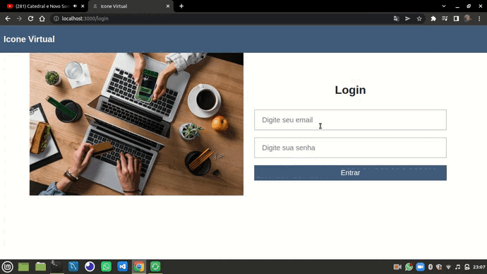

<p align="center">
   
</p>

<p align="center">
   
    
    
    
    
</p>

### Sobre o projeto

O sistema gerenciador de produtos, categorias e clientes (Visualização | Postagem | Atualização | Remoção). Para acessar sua parte front-end é necessário autenticação através do cliente
<hr>
<i>Esse front-end não tem controle de tipo usuário, ou seja, qualquer pessoa pode realizar operações administrativa (o sistema foi pensado diretamente no desenvolvimento do CRUD, e não segurança)</i>

### Como foi o back-end?

Para utilizar esse front-end diretamente da sua máquina, é necessário conhecer a API desenvolvida para esse front-end: [API](https://github.com/MateusMaciel340/api-icone-virtual)

**Importante: Tenha conhecimento prévio de dotenv!**

### Layout

O layout da aplicação da aplicação está disponível abaixo:

<div>
    <table>
      <thead>
        <tr>
           <th>
              
           </th>
        </tr>
      </thead>
      <tbody>
      </tbody>
    </table>
</div>

### 🚀 Como executar o projeto

Este projeto é dividido em três partes:

<ul>
   <li>Integração das Tipificação das Tabelas - TypeScript.</li>
   <li>Configurando ambiente de seriços para consumo da API.</li>
   <li>Aplicação do CRUD (Create | Read | Update | Delete)</li>
</ul>

💡 Aplicação constuida para front-end, mas que consume dados de API. Lembre-se de acessar ela: [API - Icone Virtual](https://github.com/MateusMaciel340/api-icone-virtual)

#### Pré-requisitos

Antes de começar, você vai precisar ter instalado em sua máquina as seguintes ferramentas: [Git](https://git-scm.com/), [Node.js](https://nodejs.org/en/). Alem disto é bom ter um editor para trabalhar com o código como [VSCode](https://code.visualstudio.com/).

##### 🧭 Rodando a aplicação web - React

```bash

# Clone este repositório
$ git clone https://github.com/MateusMaciel340/icone-virtual.git

# Acesse a pasta do projeto no terminal/cmd - React
$ cd icone-virtual/

# Instale as dependências
$ npm install

# Você pode configurar isso em Scripts
$ npm start

```

💡 Atenção: o projeto possui uma configuração do dotenv, ou seja, existe campos que contém o determinado código: 

```bash
# Acesso na porta
process.env.REACT_APP_HOSTNAME
```

**process.env.REACT_APP_HOSTANAME é o host do servidor back-end**

<i>Visualize .env.local</li>

<i>Eu tenho um arquivo chamado .env, onde está armazenando variáveis de ambiente, que estão listados em ".env.example"</i>

💡 O que você tem que fazer?

Copiar ".env.example" e criar um arquivo ".env.local" e mudar os campos de acordo com as necessidades da sua máquina.

### 🛠 Tecnologias

As seguintes ferramentas foram usadas na construção do projeto:

<b>Back-end ([Nodejs](https://nodejs.org/en/))</b>

<ul>
   <li>React</li>
   <li>CSS</li>
   <li>TypeScript</li>
   <li>CSS Puro - Estrutura</li>
   <li>Bootstrap - Modal</li>
   <li>React-Router-Dom | ReactStrap | Styled-Components</li>
</ul>

### 👨‍ Contribuidores

<div>
    <table>
      <thead>
        <tr>
           <th>
              
           </th>
        </tr>
      </thead>
      <tbody  align="center">
           <td>
             Mateus Maciel
           </td>
      </tbody>
    </table>
</div>

### 💪 Como contribuir para o projeto

1. Faça um **fork** do projeto.
2. Crie uma nova branch com as suas alterações: `git checkout -b feature/cliente`
3. Salve as alterações e crie uma mensagem de commit contando o que você fez: `git commit -m "Organizando as linhas de código da função delete cliente"`
4. Envie as suas alterações: `git push origin feature/cliente`

### 📝 Licença

Este projeto esta sobe a licença [MIT](https://github.com/nodejs/node/blob/master/LICENSE).